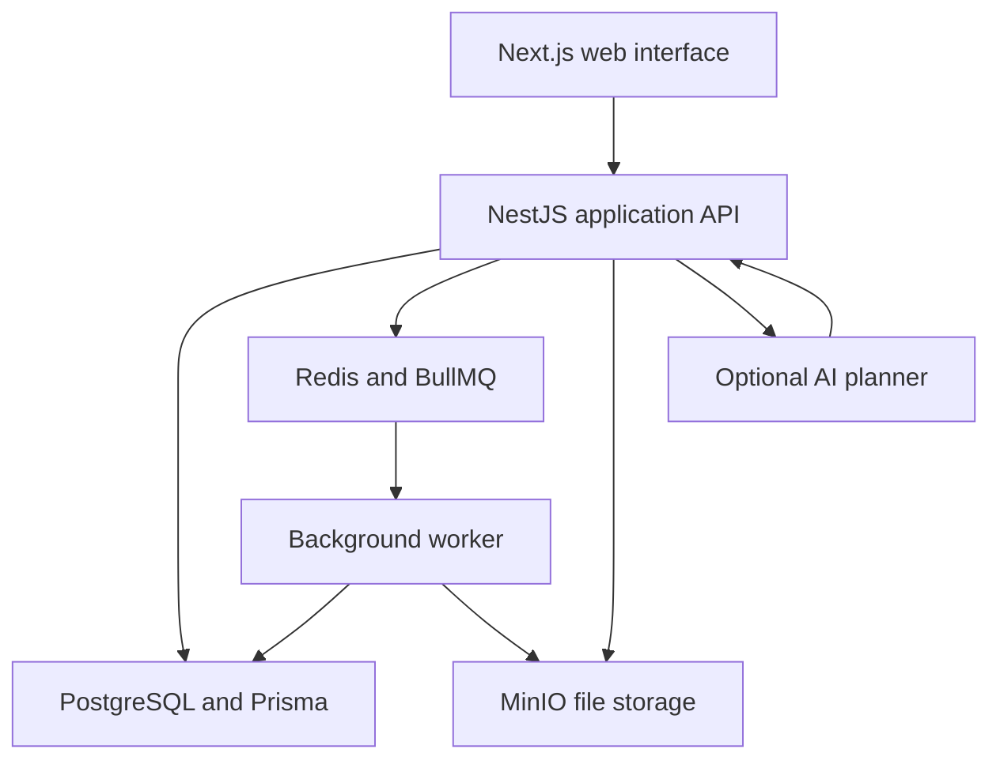

# Rahbar architecture

The application separates the interface, business services, durable records, and background processing.

The diagram represents logical responsibilities, not the production network or deployment topology.

## Application boundaries

| Boundary | Responsibility | Why it matters |
| --- | --- | --- |
| Web interface | RTL workflows, forms, task views, and conversational interaction | Multiple entry points can serve different users |
| Modular API | Authentication, scoped access, validation, workflow transitions, and business services | Business authority belongs on the server |
| Shared domain code | Money, journal balance, payroll formulas, and date rules | Critical rules can be tested separately from UI code |
| Relational data store | Transactional business records, relations, and selected database constraints | Changes have durable, consistent consequences |
| Queue and worker | Background imports and processing | Longer work does not belong in every interactive request |
| File storage | Binary objects associated with application records | File content and business metadata have different storage needs |

## Conversational actions

The assistant uses a local router for supported straightforward commands and an optional structured AI planner for more complex language. A defined action catalog bounds the available operations.

The planner returns intent and candidate fields. Server code checks the selected action, resolves entities within the user's accessible context, validates required data, and determines clarification or confirmation. Confirmed actions call the relevant business service. Permission checks also occur at execution, because access can change after a plan is prepared.

## Finance and history

Integer money calculations avoid floating-point rounding in core financial rules. Journal lines must represent a positive debit or credit, and posted entries must balance. The reviewed migrations include database checks for posted journal immutability and closed accounting periods.

These mechanisms express invariants in both application code and the data layer. They still need transaction, concurrency, and migration tests; their presence alone does not establish every financial path is correct.

## Release model

The reviewed deployment workflow builds from a recorded commit, packages an identifiable release, runs verification gates, and separates replaceable code from persistent data. Backup, restore, and rollback procedures are documented in the private repository.

Production addresses, infrastructure configuration, credentials, and operational instructions are intentionally omitted from this public overview.

[Case study](README.md) · [Product decisions](product-decisions.md) · [Verification](verification-status.md)
