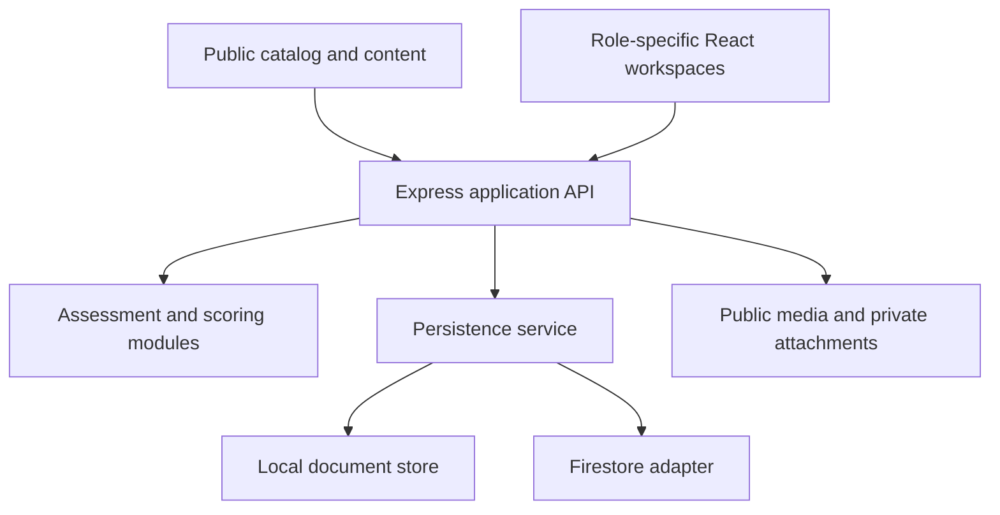

# Abnar Academy

**Connecting career exploration, assessment, learning, and academy operations.**

| | |
| --- | --- |
| Users | Learners, instructors, academy operations, finance, and employer partners |
| My contribution | Product design, learning and business workflows, AI-assisted implementation, and iteration |
| Stack | TypeScript, React 19, Vite, Express, local document persistence or Firestore |
| Reviewed version | Active development branch, revision `5d2dd35` |
| Evidence | Source reviewed; matching CI report shows **144 passing tests across 17 test files** |

## The business problem

A learner's journey can fragment across career advice, assessment, course selection, project feedback, payment, and placement. The academy team must then reconstruct that journey across spreadsheets and separate tools.

The product connects those stages while giving learners, instructors, administrators, finance, and employer partners different workspaces and access.

## A connected learner journey

The public catalog introduces schools, career paths, courses, instructors, and content. A learner can explore a career assessment, begin a placement attempt, enroll, submit a project, receive rubric-based feedback, and view certificates or portfolio work. Administrative tools support content, sales follow-up, learning operations, and payment records.

Career matching is explicitly versioned as a **pilot** in the reviewed scoring implementation. It supports exploration; this portfolio does not claim psychometric validation, predictive accuracy, or suitability for automated hiring decisions.

## Three product and engineering decisions

**1. Make assessment state durable and resumable.** Placement configurations and attempts have versions, stored responses, and result state. Seeded task generation supports reproducibility. Objective answers and evaluation data belong on the server; the client receives the material needed for the interaction.

The trade-off is more state management than a simple form, but it creates a clearer foundation for recovery, review, and repeatable tests.

**2. Separate private results from public sharing.** The implementation includes limited public result projections and consent-based talent-pool membership. Employer and public views should expose only the intended profile or portfolio fields.

This requires explicit projections and access checks. A shared link or employer role should not automatically imply access to a learner's private assessment history.

**3. Keep operations connected to the learning product.** Content administration, CRM activity, enrollment, payments, and learning records are part of the same journey. Role-specific workspaces reduce the need for every team member to use one oversized dashboard.

## Architecture

Local document persistence and Firestore are alternative configured backends. The local implementation offers a shared document/query interface with disk persistence; it is not a claim of equivalent scalability or all Firestore semantics.

The reviewed server includes authentication, role checks, request limits, security headers, content routing, and public-page metadata. Public navigation uses real links, and the latest reviewed change preserves career-path SEO metadata after client hydration.

## Verification

On **5 October 2026**, the matching private CI run was observed with **Success** status and a Vitest summary of **144 passes / 144 tests**, across **17 test files**. The workflow includes TypeScript checking, tests, a dependency audit, and build steps. A matching successful staging deployment is also listed in GitHub Actions.

Source tests cover areas including assessment generation, placement, persistence, authentication, content, finance records, routing, and end-to-end workflows. These are source and existing-CI observations; they do not establish exhaustive coverage, independent production acceptance, or scientific validation of the career instrument.

[Dated verification overview](../../engineering/verification.md)

## Business value and next measurement

The implementation connects the learner journey to the academy's daily work. Useful measures include assessment completion, resumed attempts, enrollment conversion, instructor turnaround, payment reconciliation time, and consent changes. No improvement figure is claimed without measured evidence.

[Portfolio](../../README.md)
